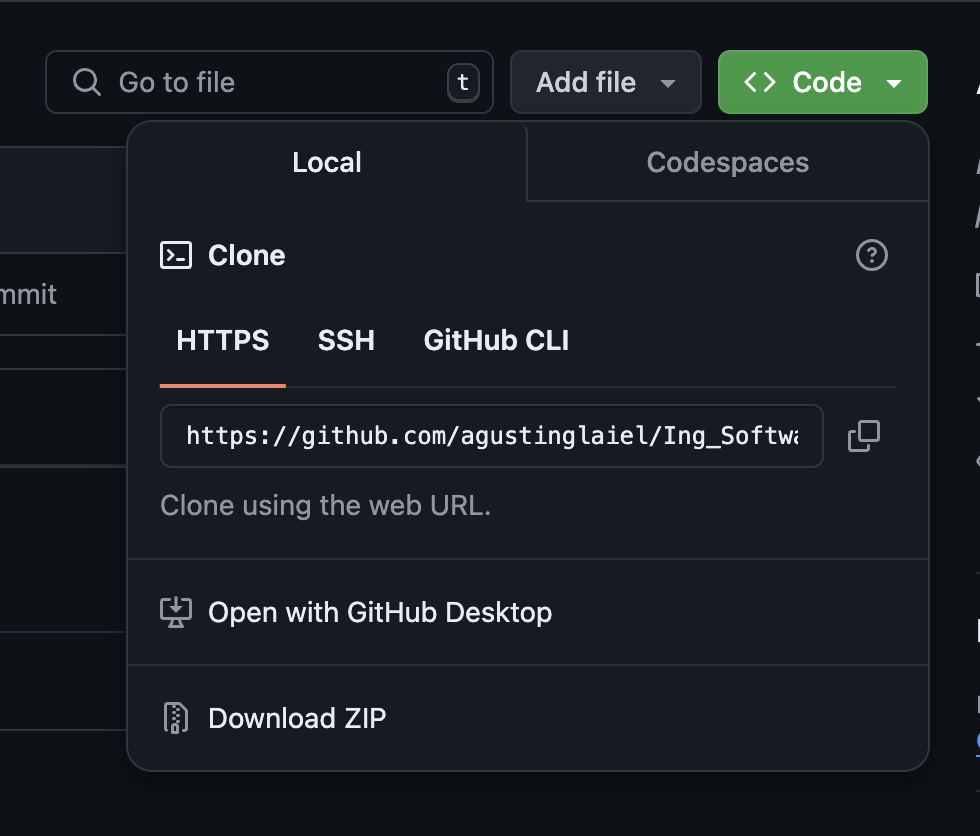
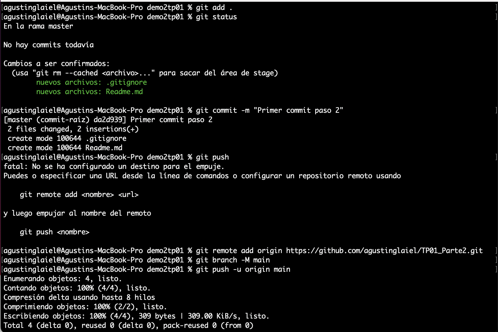
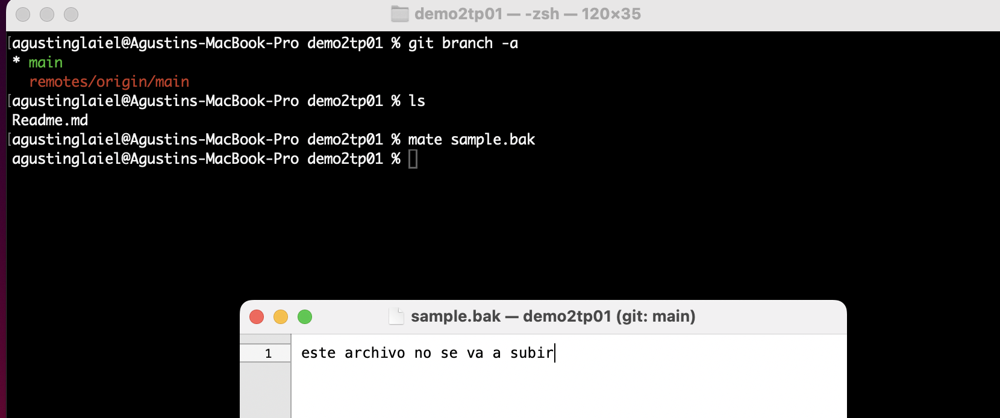
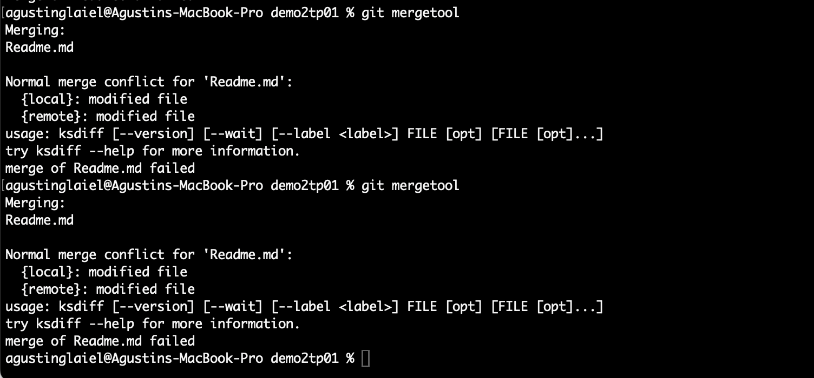

# Trabajo Práctico Número 1

## Punto 1: Instalar Git (ya lo tenia instalado)

## Punto 2: Crear un repositorio local y agregar archivos

## Punto 3: Configuración del Editor Predeterminado

### En este caso realicé los pasos mencionados en el PP presentado durante la clase para instalar TextMate

## Punto 4: Creación de Repos 01 -> Crearlo en GitHub, clonarlo localmente y subir cambios

## Punto 5: Creación de Repos 02-> Crearlo localmente y subirlo a GitHub

## Punto 6: Ramas

## Punto 7: Merges

## Punto 8: Resolución de Conflictos

## Punto 9: Familiarizarse con el concepto de Pull Request

Un Pull Request (PR) es una característica en plataformas de control de versiones como GitHub, GitLab o Bitbucket, que permite a los desarrolladores notificar a los demás miembros de un proyecto que han completado una serie de cambios en un branch (rama) y que les gustaría que esos cambios se integren en otra rama, generalmente la rama main o master.

El proceso de Pull Request incluye:

Revisión de código: Los colaboradores pueden revisar el código, dejar comentarios, sugerencias o requerir cambios antes de que el código sea aceptado.

Pruebas automatizadas: Si hay configuraciones de CI/CD, estas pueden correr automáticamente para validar los cambios.

Aprobación: Una vez que el Pull Request ha sido revisado y aprobado, los cambios pueden ser fusionados (merged) en la rama objetivo.

(Fuente: ChatGPT)

## Punto 10: Algunos ejercicios online

