# Trabajo Práctico Número 2

## Punto 1: Instalar Docker Community Edition

### Lo tenia previamente instalado en mi computadora


## Punto 2: Explorar DockerHub


## Punto 3: Obtener la imagen BusyBox


## Punto 4: Ejecutando contenedores


### En este caso no se obtuvo nada porque no ejecutamos el comando con las siguientes flags:

### -d: detached mode

### -it: interactive mode

### Lo que ocurre es que el contenedor se ejecuta exitosamente pero luega termina su ejecución sin mostrar ningun log por consola


### Aqui obtuve una lista de todos los contenedores (Incluidos los que estan apagados o con status "Exited")

## Punto 5: Ejecutando en modo interactivo


### Punto 6: Borrando contenedores terminados


### Punto 7: Construir una imagen


## Dockerfile for SimpleWebAPI

This Dockerfile sets up a basic ASP.NET Core 7.0 application called SimpleWebAPI.

```Dockerfile
# Utiliza la imagen base de ASP.NET Core 7.0 desde el repositorio de Microsoft.
FROM mcr.microsoft.com/dotnet/aspnet:7.0 AS base

# Establece el directorio de trabajo dentro del contenedor.
WORKDIR /app

# Expone el puerto 80 para tráfico HTTP.
EXPOSE 80

# Expone el puerto 443 para tráfico HTTPS.
EXPOSE 443

# Expone el puerto 5254 (puerto específico de la aplicación).
EXPOSE 5254

# Utiliza la imagen del SDK de .NET Core 7.0 para construir la aplicación.
FROM mcr.microsoft.com/dotnet/sdk:7.0 AS build

# Establece el directorio de trabajo dentro del contenedor.
WORKDIR /src

# Copia el archivo de proyecto (csproj) de la aplicación en el contenedor.
COPY ["SimpleWebAPI/SimpleWebAPI.csproj", "SimpleWebAPI/"]

# Restaura las dependencias de NuGet para el proyecto especificado.
RUN dotnet restore "SimpleWebAPI/SimpleWebAPI.csproj"

# Copia todos los archivos desde el contexto de construcción al contenedor.
COPY . .

# Cambia el directorio de trabajo al del proyecto específico dentro del contenedor.
WORKDIR "/src/SimpleWebAPI"

# Compila el proyecto en modo Release y guarda la salida en el directorio /app/build.
RUN dotnet build "SimpleWebAPI.csproj" -c Release -o /app/build

# Utiliza la imagen de compilación anterior como base para la fase de publicación.
FROM build AS publish

# Publica la aplicación, optimizando para producción y coloca la salida en /app/publish.
RUN dotnet publish "SimpleWebAPI.csproj" -c Release -o /app/publish /p:UseAppHost=false

# Utiliza la imagen base (ASP.NET) y copia los archivos publicados desde la etapa anterior.
FROM base AS final

# Establece el directorio de trabajo como /app dentro del contenedor.
WORKDIR /app

# Copia los archivos publicados desde la etapa 'publish' a la carpeta actual en el contenedor.
COPY --from=publish /app/publish .

# Establece el punto de entrada del contenedor, indicando que debe ejecutarse el archivo .dll de la aplicación.
ENTRYPOINT ["dotnet", "SimpleWebAPI.dll"]

# Comando CMD comentado, podría usarse para sobrescribir el punto de entrada, por ejemplo, para acceder a una shell.
#CMD ["/bin/bash"]
```

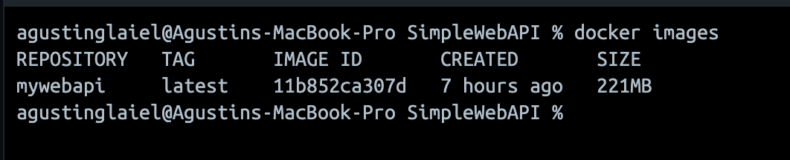

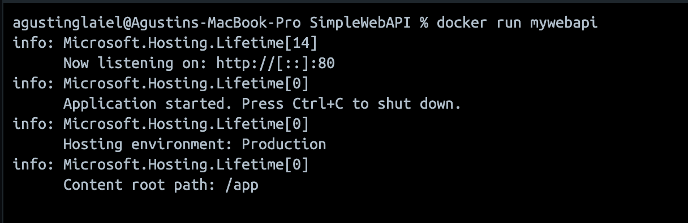

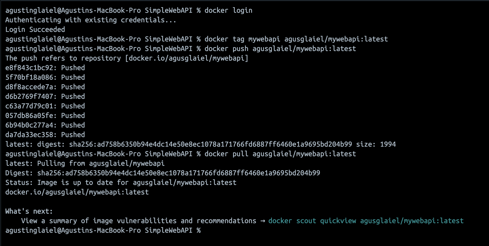

## Punto 8: Publicando puertos


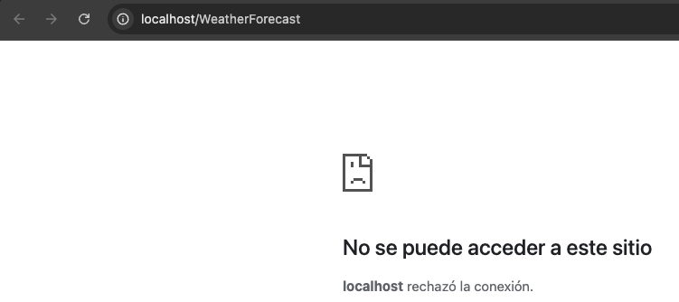

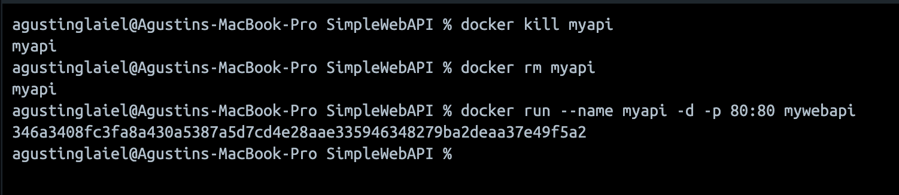

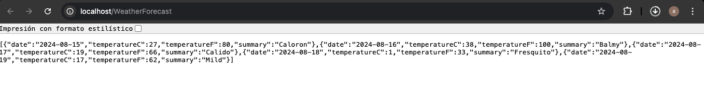

### Si bien dentro del contenedor se estaba ejecutando el servicio, nunca se publicaba en los puertos de mi maquina local sino que estaba solo en los puertos de docker. En el otro paso que hicimos, vinculamos el puerto del contenedor con el de mi maquina local logrando visualizar lo que queriamos.

## Punto 9: Modificar Dockerfile para soportar bash

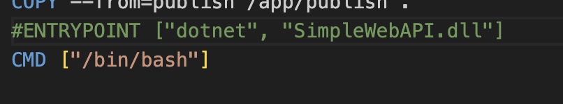

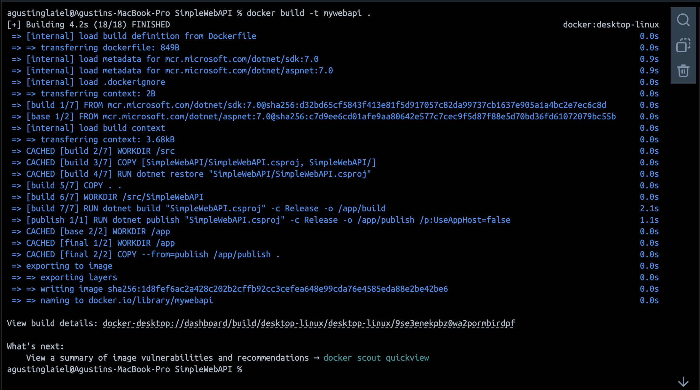

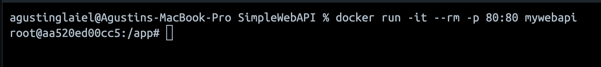

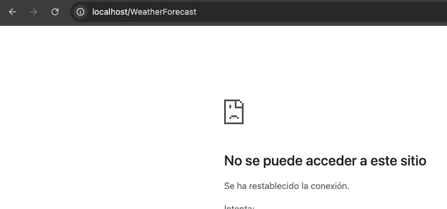

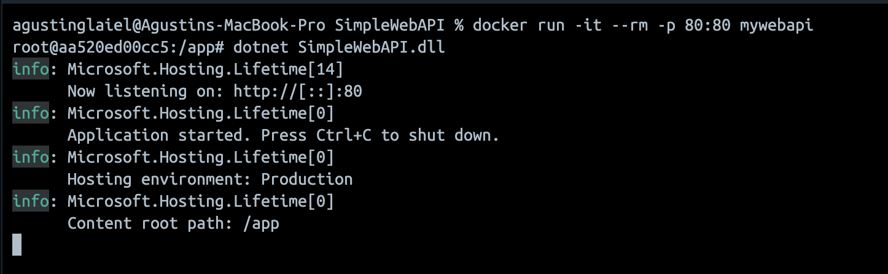

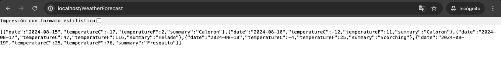

## Punto 10: Montando volúmenes

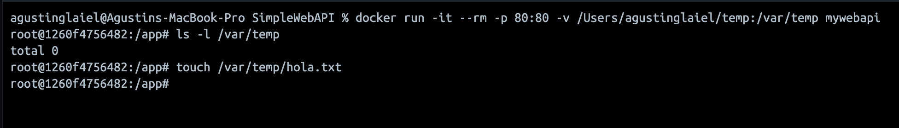

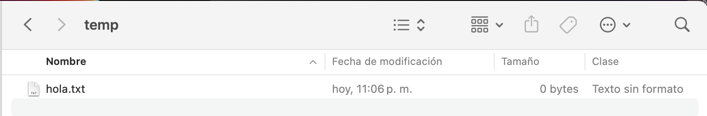

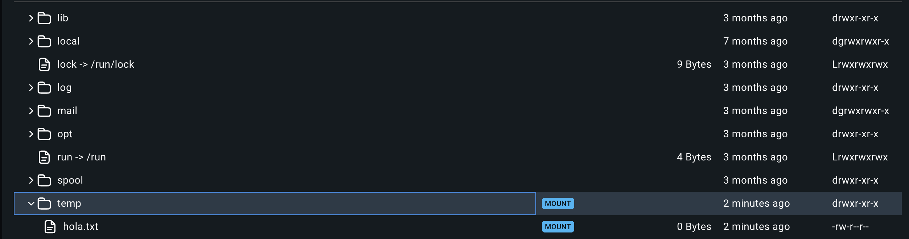

## Punto 11: Utilizando una base de datos

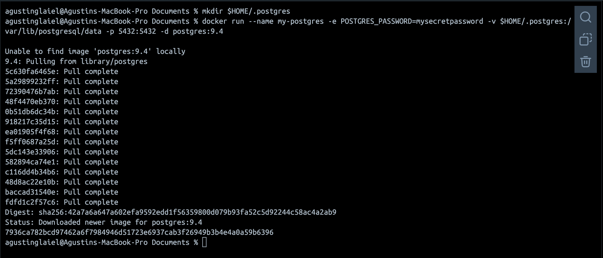

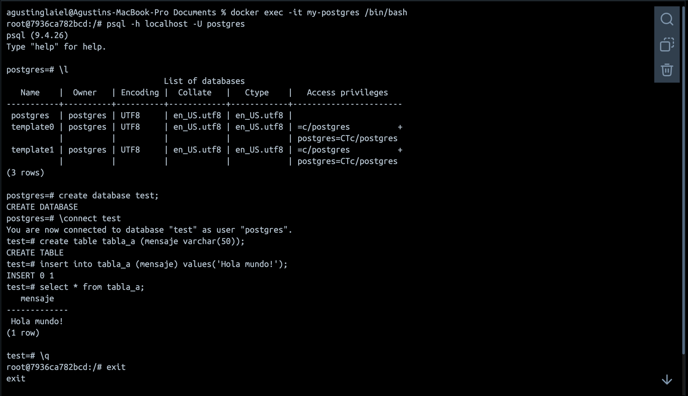

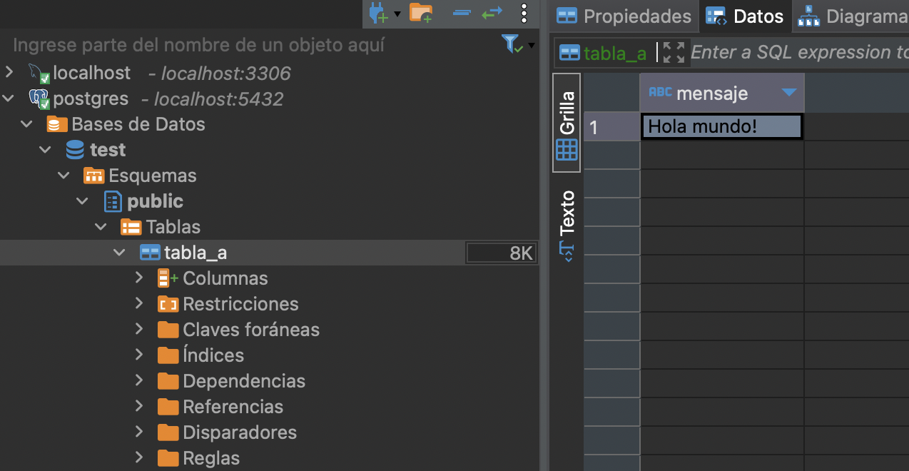

### Con docker run creamos y arrancamos un contenedor de docker que ejecuta una instancia de PostgreSQL donde tambien configuramos la contraseña, mapeamos puertos para lograr el acceso externo y asosciamos un volumen de datos para la persistencia de los mismos

### Con docker exec nos conectamos al contenedor en ejecución para interactuar directamente con la base de datos a traves de la linea de comandos, permitiendonos gestionar la BDD y ejectuar consultas SQL directamente dentro del contenedor

## Punto 12: Hacer el punto 11 con Microsoft SQL Server

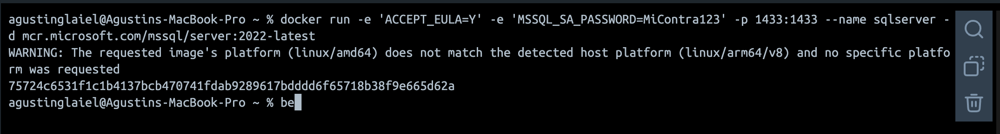

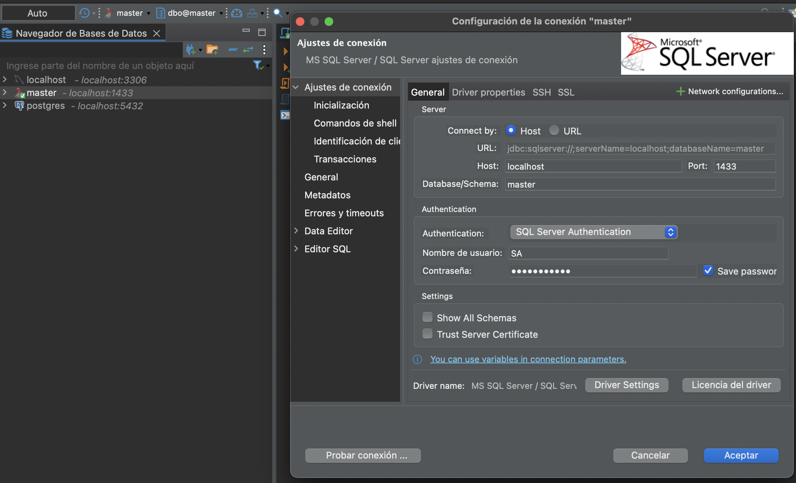

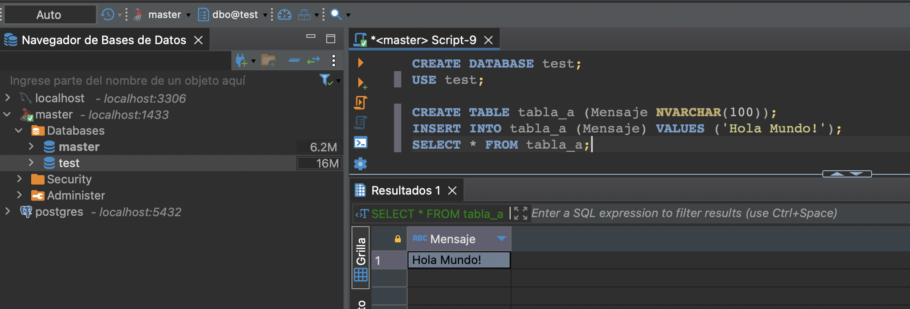

## Punto 13: Presentación del trabajo práctico.

### Subir un archivo md (puede ser en una carpeta) trabajo-practico-02 con las salidas de los comandos utilizados. Si es necesario incluir también capturas de pantalla.
