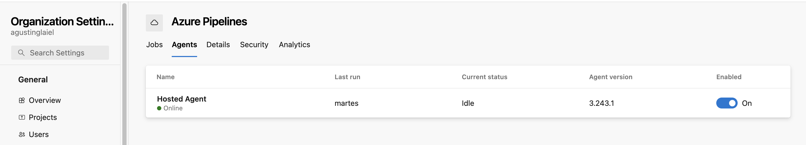
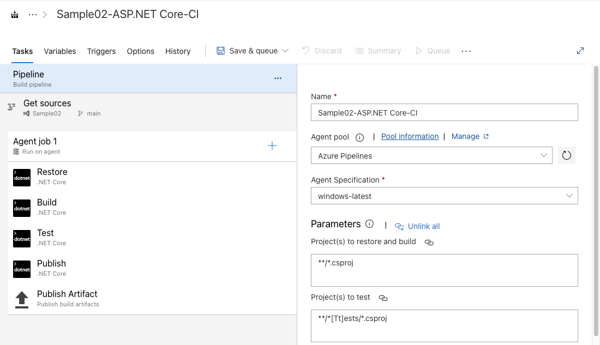
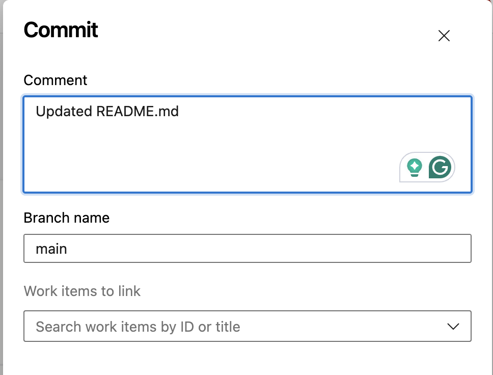

# Trabajo Práctico Número 4

## Punto 1: Verificar acceso a Pipelines concedido

## Punto 2: Agregar en pipeline YAML una tarea de Publish.

## Punto 3: Explicar por qué es necesario contar con una tarea de Publish en un pipeline que corre en un agente de Microsoft en la nube.

### Esta tarea es crucial porque permite que los artefactos generados en el agente se almacenen en un lugar accesible, como el almacenamiento de artefactos de Azure DevOps. Sin esta tarea, los artefactos no serían accesibles después de que el pipeline termine.

## Punto 4: Descargar el resultado del pipeline y correr localmente el software compilado.

## Punto 5: Habilitar el editor clásico de pipelines. Explicar las diferencias claves entre este tipo de editor y el editor YAML.

### El editor clásico de Azure DevOps es una interfaz gráfica que facilita la creación de pipelines a través de formularios y opciones desplegables, lo que lo hace ideal para principiantes o usuarios que prefieren trabajar sin escribir código. Aunque es fácil de usar, tiene limitaciones en cuanto a flexibilidad y personalización avanzada. Además, la configuración de pipelines en el editor clásico no se integra automáticamente con el control de versiones, lo que puede dificultar la colaboración y el seguimiento de cambios en proyectos más grandes.

### Por otro lado, el editor YAML permite definir pipelines como código, lo que ofrece una mayor flexibilidad y control sobre la configuración del pipeline. Al estar almacenado directamente en el repositorio, el archivo YAML se versiona junto con el código fuente, facilitando la colaboración y la trazabilidad de los cambios. Aunque tiene una curva de aprendizaje más pronunciada, especialmente para usuarios no familiarizados con YAML, el editor YAML es más adecuado para proyectos complejos que requieren una configuración más detallada y reutilizable. En resumen, el editor clásico es más accesible, mientras que YAML proporciona un control más robusto y es ideal para entornos de desarrollo más avanzados.

## Punto 6: Crear un nuevo pipeline con el editor clásico. Descargar el resultado del pipeline y correr localmente el software compilado.

## Punto 7: Configurar CI en ambos pipelines (YAML y Classic Editor). Mostrar resultados de la ejecución automática de ambos pipelines al hacer un commit en la rama main.

## Punto 8: Explicar la diferencia entre un agente MS y un agente Self-Hosted. Qué ventajas y desventajas hay entre ambos? Cuándo es conveniente y/o necesario usar un Self-Hosted Agent?

### Un agente MS es un agente en la nube gestionado por Azure DevOps. Es fácil de usar, sin necesidad de gestionar infraestructura, pero tiene menos control sobre el entorno y puede haber tiempos de espera en momentos de alta demanda.

### Un agente Self-Hosted es un agente que configuras en tu propia infraestructura, dándote control total sobre el entorno y sin limitaciones de tiempo de ejecución. Sin embargo, requiere mantenimiento y gestión continua.

### Usa un agente Self-Hosted cuando necesitas un entorno personalizado, integrar software específico o evitar las limitaciones de los agentes en la nube.

## Punto 9: Crear un Pool de Agentes y un Agente Self-Hosted

## Punto 10: Instalar y correr un agente en nuestra máquina local.

## Punto 11: Crear un pipeline que use el agente Self-Hosted alojado en nuestra máquina local.

## Punto 12: Buscar el resultado del pipeline y correr localmente el software compilado.

## Punto 13: Crear un nuevo proyecto en ADO clonado desde un repo que contenga una aplicación en Angular

## Punto 14: Configurar un pipeline de build para un proyecto de tipo Angular como el clonado.

## Punto 15: Habilitar CI para el pipeline.

## Punto 16: Hacer un cambio a un archivo del proyecto (algún cambio en el HTML que se renderiza por ejemplo) y verificar que se ejecute automáticamente el pipeline.

## Punto 17: Descargar el resultado del pipeline y correr en un servidor web local el sitio construido.

## Punto 18: Mostrar el antes y el después del cambio.

