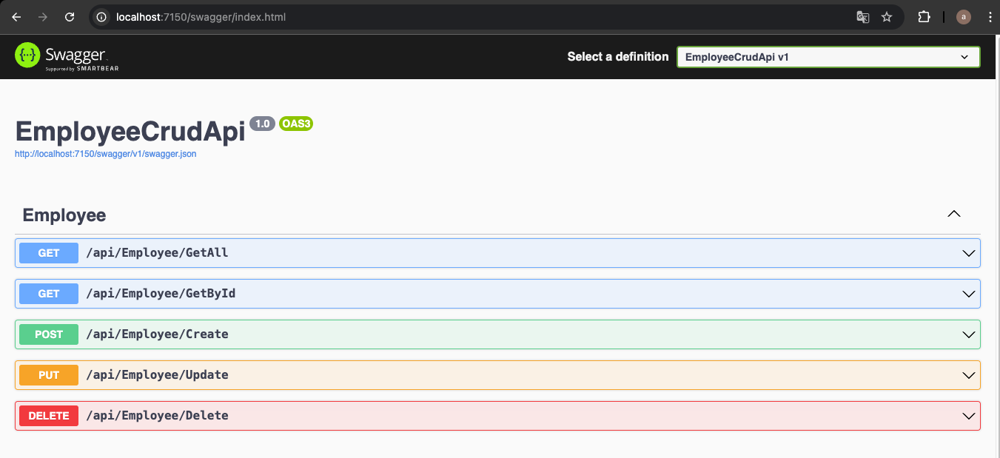

# Trabajo Práctico Número 6

## Punto 1: Creación de una BD SQL Server para nuestra App

## Punto 2: Obtener nuestra App

## Punto 3: Crear Pruebas Unitarias para nuestra API

## Punto 4: Creamos pruebas unitarias para nuestro front de Angular:

## Punto 5: Agregamos generación de reporte XML de nuestras pruebas de front.

## Punto 6: Modificamos el código de nuestra API y creamos nuevas pruebas unitarias:

## Punto 7: Modificamos el código de nuestro Front y creamos nuevas pruebas unitarias:

