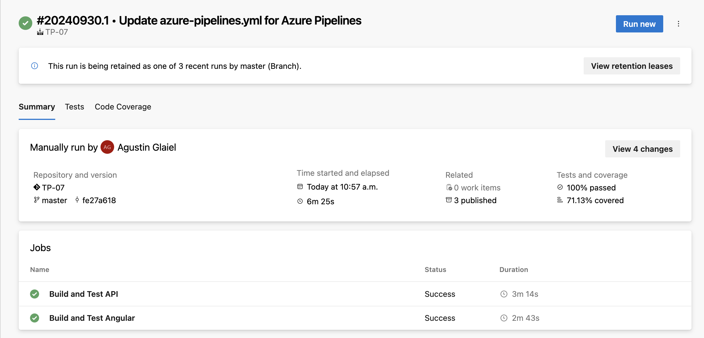
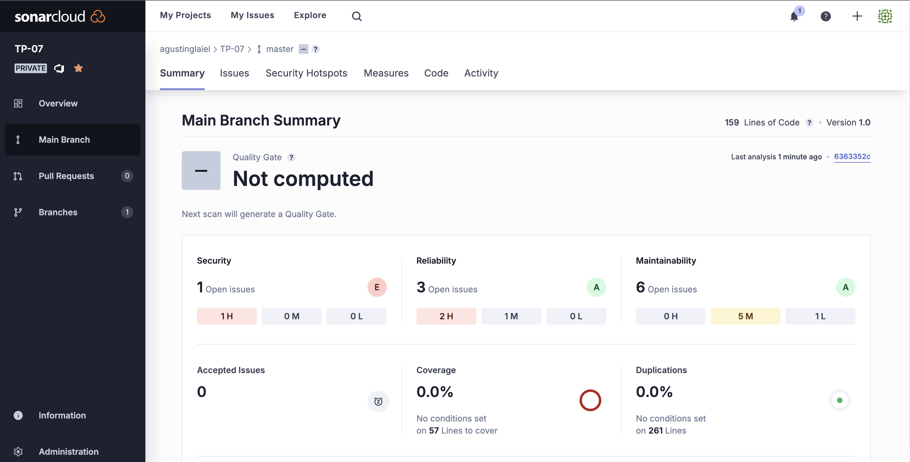
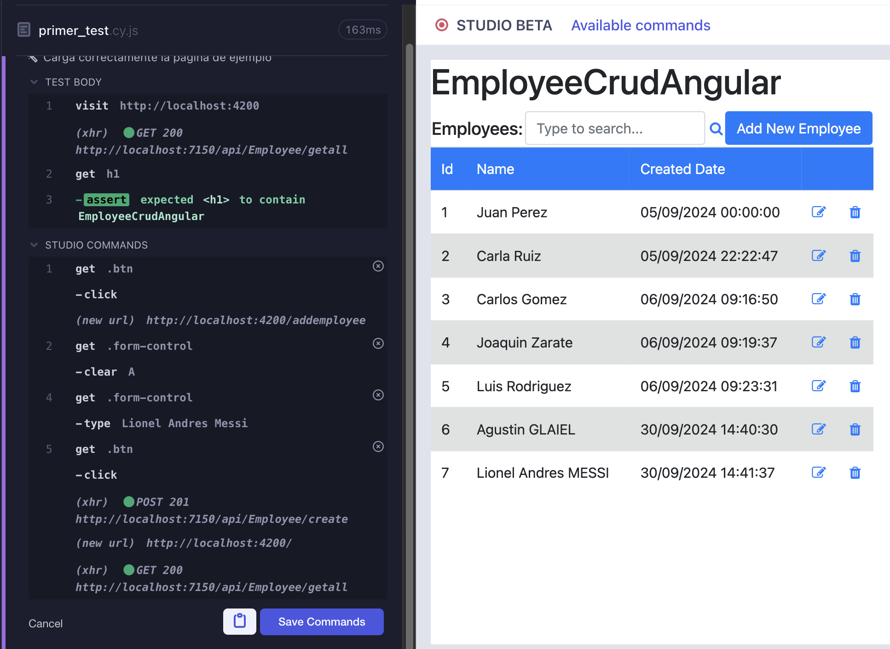

# Trabajo Práctico Número 7

## Punto 1: Agregar Code Coverage a nuestras pruebas unitarias de backend y front-end e integrarlas junto con sus resultados en nuestro pipeline de build.





## Punto 2: Agregar Análisis Estático de Código con SonarCloud:





## Punto 3: Pruebas de Integración con Cypress:





## Punto 4: Integrar en el pipeline SonarCloud para nuestro proyecto Angular, mostrar el resultado obtenido en SonarCloud

## Implementar en Cypress pruebas de integración que incluya los casos desarrollados como pruebas unitarias del front en el TP06.

## Incorporar al pipeline de Deploy la ejecución de las pruebas de integración y la visualización de sus resultados.

## El codigo YML utilizado es:

```
trigger:
- main

pool:
  vmImage: 'windows-latest'

variables:
  solution: '**/*.sln'
  buildPlatform: 'Any CPU'
  buildConfiguration: 'Release'
  frontPath: 'EmployeeCrudAngular'

stages:
- stage: BuildAndTest
  displayName: "Build and Test API and Front"
  jobs:

  # Job 1: Compilar y probar la API .NET
  - job: BuildDotnet
    displayName: "Build and Test API"
    pool:
      vmImage: 'windows-latest'
    steps:
    - checkout: self
      fetchDepth: 0

    # Preparar SonarCloud antes de la compilación de back
    - task: SonarCloudPrepare@2
      inputs:
        SonarCloud: 'SonarCloud'
        organization: 'agustinglaiel'
        scannerMode: 'CLI'
        configMode: 'manual'
        cliprojectKey: 'agustinglaiel_TP-07'
        cliprojectName: 'TP-07'
        cliSources: '.'
        extraProperties: |
          sonar.cs.opencover.reportsPaths=$(Agent.TempDirectory)/**/coverage.opencover.xml
          sonar.javascript.lcov.reportPaths=$(System.DefaultWorkingDirectory)/$(frontPath)/coverage/lcov.info
      displayName: 'Prepare SonarCloud'

    # Instalar .NET SDK
    - task: UseDotNet@2
      displayName: 'Instalar .NET SDK 8.x'
      inputs:
        packageType: 'sdk'
        version: '8.x'
        installationPath: $(Agent.ToolsDirectory)/dotnet

    - task: DotNetCoreCLI@2
      displayName: 'Restaurar paquetes NuGet'
      inputs:
        command: restore
        projects: '**/*.csproj'

    # Ejecutar pruebas de la API con xUnit y coverlet para la cobertura de código
    - task: DotNetCoreCLI@2
      displayName: 'Ejecutar pruebas de la API'
      inputs:
        command: 'test'
        projects: '**/*.Tests.csproj'
        arguments: '--collect:"XPlat Code Coverage" --logger "trx;LogFileName=$(Agent.TempDirectory)/TestResults.trx" --blame'  # Corrección en el logger y eliminación del duplicado
        publishTestResults: true

    # Publicar resultados de pruebas
    - task: PublishTestResults@2
      displayName: 'Publicar resultados de pruebas de la API'
      inputs:
        testResultsFormat: 'VSTest'
        testResultsFiles: '$(Agent.TempDirectory)/*.trx'
        failTaskOnFailedTests: true

    # Publicar resultados de cobertura
    - task: PublishCodeCoverageResults@2
      displayName: 'Publicar resultados de code coverage del back-end'
      inputs:
        codeCoverageTool: 'Cobertura'
        summaryFileLocation: '$(Agent.TempDirectory)/**/coverage.cobertura.xml'
        reportDirectory: '$(Agent.TempDirectory)/CodeCoverage'
        failIfCoverageEmpty: true

    - task: DotNetCoreCLI@2
      displayName: 'Compilar la API'
      inputs:
        command: build
        projects: '$(solution)'
        arguments: '--configuration $(buildConfiguration)'

    # Analizar con SonarCloud después del build
    - task: SonarCloudAnalyze@2
      inputs:
        jdkversion: 'JAVA_HOME_17_X64'

    # Publicar los resultados de SonarCloud
    - task: SonarCloudPublish@2
      inputs:
        pollingTimeoutSec: '300'
      displayName: 'Publish SonarCloud'

    - task: DotNetCoreCLI@2
      displayName: 'Publicar aplicación'
      inputs:
        command: publish
        publishWebProjects: True
        arguments: '--configuration $(buildConfiguration) --output $(Build.ArtifactStagingDirectory)'
        zipAfterPublish: true

    - task: PublishBuildArtifacts@1
      displayName: 'Publicar artefactos de compilación'
      inputs:
        PathtoPublish: '$(Build.ArtifactStagingDirectory)'
        ArtifactName: 'api-drop'
        publishLocation: 'Container'

  # Job 2: Compilar y probar el front-end Angular
  - job: BuildAngular
    displayName: "Build and Test Angular"
    pool:
      vmImage: 'ubuntu-latest'
    steps:
    - task: NodeTool@0
      displayName: 'Instalar Node.js'
      inputs:
        versionSpec: '22.x'

    - script: npm install --legacy-peer-deps
      displayName: 'Instalar dependencias'
      workingDirectory: $(System.DefaultWorkingDirectory)/$(frontPath)

    - script: npx ng test --karma-config=$(System.DefaultWorkingDirectory)/$(frontPath)/karma.conf.js --watch=false --browsers ChromeHeadless --code-coverage
      displayName: 'Ejecutar pruebas del front'
      workingDirectory: $(System.DefaultWorkingDirectory)/$(frontPath)
      continueOnError: true

    - task: PublishCodeCoverageResults@2
      displayName: 'Publicar resultados de code coverage del front'
      inputs:
        summaryFileLocation: '$(System.DefaultWorkingDirectory)/$(frontPath)/coverage/lcov.info'
        failIfCoverageEmpty: false
      condition: always()

    - task: PublishTestResults@2
      displayName: 'Publicar resultados de pruebas unitarias del front'
      inputs:
        testResultsFormat: 'JUnit'
        testResultsFiles: '$(System.DefaultWorkingDirectory)/$(frontPath)/test-results/test-results.xml'
        failTaskOnFailedTests: true
      condition: always()

    - script: npm run build
      displayName: 'Compilar el proyecto Angular'
      workingDirectory: $(System.DefaultWorkingDirectory)/$(frontPath)

    - task: PublishBuildArtifacts@1
      displayName: 'Publicar artefactos Angular'
      inputs:
        PathtoPublish: '$(System.DefaultWorkingDirectory)/$(frontPath)/dist'
        ArtifactName: 'front-drop'

- stage: DeployToQA
  displayName: "Deploy to QA with Integration Tests"
  jobs:
  - job: Deploy
    displayName: "Deploy QA"
    pool:
      vmImage: 'windows-latest'
    steps:
    - script: echo "Deploy steps for API and Angular in QA environment"
    # Aquí se pueden agregar más pasos de despliegue, como publicación en un servidor
```


## ANÁLISIS

### Estado del Quality Gate: El análisis de SonarCloud muestra que hemos pasado satisfactoriamente el Quality Gate (Obviamente ya que lo establecimos al 0%). Esto seria un buen indicador, ya que significa que el código cumple con las condiciones mínimas requeridas para la calidad. A pesar de haber pasado esta primera validación, aún quedan varias áreas que debemos revisar con atención por lo que ya comenté de que se estableció el Quality Gate en 0%

### Cobertura de Código: Un aspecto preocupante del análisis es que la cobertura de código actual es 0%. Esto significa que no se han establecido tests que cubran las líneas de código críticas del proyecto, o los tests actuales no están alcanzando las áreas necesarias. La cobertura de código es uno de los factores clave para garantizar la fiabilidad de un software, ya que permite detectar errores a través de pruebas automatizadas. En este momento, no podemos asegurar que las funciones del sistema estén siendo correctamente validadas, lo que nos deja en una situación vulnerable a errores que podrían haber sido evitados mediante una buena suite de pruebas.

### Duplicaciones en el código: el porcentaje es muy bajo, solo del 0,2% lo que es bueno ya que se evito la repetición de bloques de codigo. Esto obviamente es bueno porque el codigo duplicado puede generar problema de mantenibilidad e incluso aumentar el riesgo de introducir errores cuando se introducen cambios.

### Problemas de Seguridad: En el análisis de seguridad, se detectó un problema crítico que debe ser resuelto con urgencia. Este problema surge debido a la presencia de una contraseña de la base de datos almacenada en el archivo de configuración (appsettings.json). Esto representa una seria vulnerabilidad, ya que cualquier persona que tenga acceso al código fuente podría acceder a información sensible. La mejor práctica en estos casos es remover las contraseñas y demás credenciales sensibles del código fuente, y gestionar estas variables a través de mecanismos más seguros como variables de entorno o servicios de almacenamiento de secretos.

### Mantenibilidad y Code Smells: SonarCloud ha identificado 27 problemas de mantenibilidad, que suman un total de aproximadamente 18 minutos de esfuerzo estimado para resolverlos. Estos problemas son lo que comúnmente se denominan Code Smells, o "malos olores" en el código. Los Code Smells no suelen ser errores críticos que rompan el funcionamiento de la aplicación, pero son signos de que el código podría estar mal estructurado o ser difícil de entender y mantener a largo plazo.

### Algunos ejemplos de estos problemas incluyen:

### Comentarios "TODO" no resueltos: Hay varios comentarios en el código que marcan tareas pendientes que deben completarse. Ignorar estos "TODOs" puede llevar a problemas futuros cuando el equipo pierda contexto sobre lo que se debe hacer.

### Código no utilizado: Hay variables, parámetros o funciones que no se están utilizando, lo cual incrementa la complejidad del código innecesariamente.

### Mejora en la estructura de las tablas HTML: Se han detectado problemas de accesibilidad que sugieren que es necesario incluir encabezados de tabla (th) y descripciones alternativas (alt) en las imágenes para mejorar la estructura semántica del código HTML.

### Confiabilidad: La confiabilidad del sistema también ha sido evaluada, y SonarCloud ha identificado 6 problemas, clasificados como bugs menores y de mediana gravedad. Estos bugs pueden no causar errores de inmediato, pero podrían convertirse en problemas críticos si no se les presta atención.

## Los test en cypress quedaron de la siguiente manera:


