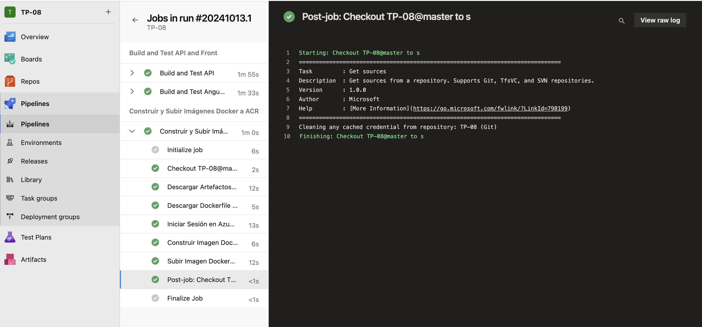

# Trabajo Práctico Número 7

## Prerequisitos


## Punto 1: Crear archivos DockerFile para nuestros proyectos de Back y Front


## Punto 2: Crear un recurso ACR en Azure Portal siguiendo el instructivo 5.1


## Punto 3: Modificar nuestro pipeline en la etapa de Build y Test

```
    # Publicar Dockerfile de Back
    - task: PublishPipelineArtifact@1
      displayName: 'Publicar Dockerfile de Back'
      inputs:
        targetPath: '$(Build.SourcesDirectory)/docker/api/Dockerfile'
        artifact: 'dockerfile-back'
```

```
    # Publicar Dockerfile de Front
    - task: PublishPipelineArtifact@1
      displayName: 'Publicar Dockerfile de Front'
      inputs:
        targetPath: '$(Build.SourcesDirectory)/docker/front/Dockerfile'
        artifact: 'dockerfile-front'
```


## Punto 4: En caso de no contar en nuestro proyecto con una ServiceConnection a Azure Portal para el manejo de recursos, agregar una service connection a Azure Resource Manager como se indica en instructivo 5.2


## Punto 5: Agregar a nuestro pipeline variables


## Punto 6: Agregar a nuestro pipeline una nueva etapa que dependa de nuestra etapa de Build y Test

```
# #----------------------------------------------------------
# ### STAGE BUILD DOCKER IMAGES Y PUSH A AZURE CONTAINER REGISTRY
# #----------------------------------------------------------

- stage: DockerBuildAndPush
  displayName: 'Construir y Subir Imágenes Docker a ACR'
  dependsOn: BuildAndTest
  jobs:
   - job: docker_build_and_push
     displayName: 'Construir y Subir Imágenes Docker a ACR'
     pool:
       vmImage: 'ubuntu-latest'

     steps:
       - checkout: self

       #----------------------------------------------------------
       # BUILD DOCKER BACK IMAGE Y PUSH A AZURE CONTAINER REGISTRY
       #----------------------------------------------------------

       - task: DownloadPipelineArtifact@2
         displayName: 'Descargar Artefactos de Back'
         inputs:
           buildType: 'current'
           artifactName: 'api-drop'
           targetPath: '$(Pipeline.Workspace)/drop-back'

       - task: DownloadPipelineArtifact@2
         displayName: 'Descargar Dockerfile de Back'
         inputs:
           buildType: 'current'
           artifactName: 'dockerfile-back'
           targetPath: '$(Pipeline.Workspace)/dockerfile-back'

       - task: AzureCLI@2
         displayName: 'Iniciar Sesión en Azure Container Registry (ACR)'
         inputs:
           azureSubscription: '$(ConnectedServiceName)'
           scriptType: bash
           scriptLocation: inlineScript
           inlineScript: |
             az acr login --name $(acrLoginServer)

       - task: Docker@2
         displayName: 'Construir Imagen Docker para Back'
         inputs:
           command: build
           repository: $(acrLoginServer)/$(backImageName)
           dockerfile: $(Pipeline.Workspace)/dockerfile-back/Dockerfile
           buildContext: $(Pipeline.Workspace)/drop-back
           tags: 'latest'

       - task: Docker@2
         displayName: 'Subir Imagen Docker de Back a ACR'
         inputs:
           command: push
           repository: $(acrLoginServer)/$(backImageName)
           tags: 'latest'
```

## Punto 7: Ejecutar el pipeline y en Azure Portal acceder a la opción Repositorios de nuestro recurso Azure Container Registry. Verificar que exista una imagen con el nombre especificado en la variable backImageName asignada en nuestro pipeline




## Punto 8: Agregar tareas para generar imagen Docker de Front (DESAFIO)

```
       #----------------------------------------------------------
       # BUILD DOCKER FRONT IMAGE Y PUSH A AZURE CONTAINER REGISTRY
       #----------------------------------------------------------

       - task: DownloadPipelineArtifact@2
         displayName: 'Descargar Artefactos de Front'
         inputs:
           buildType: 'current'
           artifactName: 'front-drop'
           targetPath: '$(Pipeline.Workspace)/drop-front'

       - task: DownloadPipelineArtifact@2
         displayName: 'Descargar Dockerfile de Front'
         inputs:
           buildType: 'current'
           artifactName: 'dockerfile-front'
           targetPath: '$(Pipeline.Workspace)/dockerfile-front'

       - task: AzureCLI@2
         displayName: 'Iniciar Sesión en Azure Container Registry (ACR)'
         inputs:
           azureSubscription: '$(ConnectedServiceName)'
           scriptType: bash
           scriptLocation: inlineScript
           inlineScript: |
             az acr login --name $(acrLoginServer)

       - task: Docker@2
         displayName: 'Construir Imagen Docker para Front'
         inputs:
           command: build
           repository: $(acrLoginServer)/$(frontImageName)
           dockerfile: $(Pipeline.Workspace)/dockerfile-front/Dockerfile
           buildContext: $(Pipeline.Workspace)/drop-front/employee-crud-angular/browser
           tags: 'latest'

       - task: Docker@2
         displayName: 'Subir Imagen Docker de Front a ACR'
         inputs:
           command: push
           repository: $(acrLoginServer)/$(frontImageName)
           tags: 'latest'
```


## Punto 9: Agregar a nuestro pipeline una nueva etapa que dependa de nuestra etapa de Construcción de Imagenes Docker y subida a ACR


## Punto 10: Ejecutar el pipeline y en Azure Portal acceder al recurso de Azure Container Instances creado. Copiar la url del contenedor y navegarlo desde browser. Verificar que traiga datos.


## Punto 11: Agregar tareas para generar un recurso Azure Container Instances que levante un contenedor con nuestra imagen de front (DESAFIO)


## Punto 12: Agregar tareas para correr pruebas de integración en el entorno de QA de Back y Front creado en ACI.


## DESAFIO:

### Agregar tareas para generar imagen Docker de Front. (Realizado en el Punto 4.1.8)

### Agregar tareas para generar en Azure Container Instances un contenedor de imagen Docker de Front. (Realizado en el Punto 4.1.11)

### Agregar tareas para correr pruebas de integración en el entorno de QA de Back y Front creado en ACI. (Realizado en el Punto 4.1.12)

### Agregar etapa que dependa de la etapa de Deploy en ACI QA y genere contenedores en ACI para entorno de PROD. (DEBAJO)


## Pipeline Final:

```
trigger:
- main

pool:
  vmImage: 'windows-latest'

variables:
  solution: '**/*.sln'
  buildPlatform: 'Any CPU'
  buildConfiguration: 'Release'
  frontPath: 'EmployeeCrudAngular'
  ConnectedServiceName: 'ServiceConnectionARM'
  acrLoginServer: 'agingsoft3uccacr.azurecr.io'
  acrName: 'AGIngSoft3UCCACR'
  backImageName: 'employee-crud-api'
  frontImageName: 'employee-crud-frontend'
  ResourceGroupName: 'TPSIngSoft3UCC2024'
  backContainerInstanceNameQA: 'as-crud-api-qa-agustinglaiel'
  frontContainerInstanceNameQA: 'as-crud-front-qa-agustinglaiel'
  frontImageTag: 'latest'
  container-cpu-front-qa: 1
  container-memory-front-qa: 1.5
  backImageTag: 'latest'
  container-cpu-api-qa: 1
  container-memory-api-qa: 1.5
  baseUrlBackEnd: 'http://$(backContainerInstanceNameQA).eastus.azurecontainer.io'
  baseUrlFrontEnd: 'http://$(frontContainerInstanceNameQA).eastus.azurecontainer.io'
  backContainerInstanceNamePROD: 'as-crud-api-prod-agustinglaiel'
  frontContainerInstanceNamePROD: 'as-crud-front-prod-agustinglaiel'
  container-cpu-api-prod: 1
  container-memory-api-prod: 1.5
  container-cpu-front-prod: 1
  container-memory-front-prod: 1.5

stages:
- stage: BuildAndTest
  displayName: "Build and Test API and Front"
  jobs:

  # Job 1: Compilar y probar la API .NET
  - job: BuildDotnet
    displayName: "Build and Test API"
    pool:
      vmImage: 'windows-latest'
    steps:
    - checkout: self
      fetchDepth: 0

    # Instalar .NET SDK
    - task: UseDotNet@2
      displayName: 'Instalar .NET SDK 8.x'
      inputs:
        packageType: 'sdk'
        version: '8.x'
        installationPath: $(Agent.ToolsDirectory)/dotnet

    - task: DotNetCoreCLI@2
      displayName: 'Restaurar paquetes NuGet'
      inputs:
        command: restore
        projects: '**/*.csproj'

    - task: DotNetCoreCLI@2
      displayName: 'Compilar la API'
      inputs:
        command: build
        projects: '$(solution)'
        arguments: '--configuration $(buildConfiguration)'
        zipAfterPublish: false

    - task: DotNetCoreCLI@2
      displayName: 'Publicar aplicación'
      inputs:
        command: publish
        publishWebProjects: True
        arguments: '--configuration $(buildConfiguration) --output $(Build.ArtifactStagingDirectory)'
        zipAfterPublish: false

    - task: PublishBuildArtifacts@1
      displayName: 'Publicar artefactos de compilación'
      inputs:
        PathtoPublish: '$(Build.ArtifactStagingDirectory)'
        ArtifactName: 'api-drop'
        publishLocation: 'Container'

    # Publicar Dockerfile de Back
    - task: PublishPipelineArtifact@1
      displayName: 'Publicar Dockerfile de Back'
      inputs:
        targetPath: '$(Build.SourcesDirectory)/docker/api/Dockerfile'
        artifact: 'dockerfile-back'

  # Job 2: Compilar y probar el front-end Angular
  - job: BuildAngular
    displayName: "Build and Test Angular"
    pool:
      vmImage: 'ubuntu-latest'
    steps:
    - task: NodeTool@0
      displayName: 'Instalar Node.js'
      inputs:
        versionSpec: '22.x'

    - script: npm install --legacy-peer-deps
      displayName: 'Instalar dependencias'
      workingDirectory: $(System.DefaultWorkingDirectory)/$(frontPath)

    - script: npm run build
      displayName: 'Compilar el proyecto Angular'
      workingDirectory: $(System.DefaultWorkingDirectory)/$(frontPath)

    - task: PublishBuildArtifacts@1
      displayName: 'Publicar artefactos Angular'
      inputs:
        PathtoPublish: '$(System.DefaultWorkingDirectory)/$(frontPath)/dist'
        ArtifactName: 'front-drop'

    # Verificar si el Dockerfile del front existe antes de publicarlo
    - script: |
        if [ -f "$(Build.SourcesDirectory)/docker/front/Dockerfile" ]; then
          echo "Dockerfile de Front encontrado."
        else
          echo "Dockerfile de Front no encontrado."
          exit 1
        fi
      displayName: 'Verificar existencia de Dockerfile de Front'

    # Publicar Dockerfile de Front
    - task: PublishPipelineArtifact@1
      displayName: 'Publicar Dockerfile de Front'
      inputs:
        targetPath: '$(Build.SourcesDirectory)/docker/front/Dockerfile'
        artifact: 'dockerfile-front'

# #----------------------------------------------------------
# ### STAGE BUILD DOCKER IMAGES Y PUSH A AZURE CONTAINER REGISTRY
# #----------------------------------------------------------

- stage: DockerBuildAndPush
  displayName: 'Construir y Subir Imágenes Docker a ACR'
  dependsOn: BuildAndTest
  jobs:
   - job: docker_build_and_push
     displayName: 'Construir y Subir Imágenes Docker a ACR'
     pool:
       vmImage: 'ubuntu-latest'

     steps:
       - checkout: self

       #----------------------------------------------------------
       # BUILD DOCKER BACK IMAGE Y PUSH A AZURE CONTAINER REGISTRY
       #----------------------------------------------------------

       - task: DownloadPipelineArtifact@2
         displayName: 'Descargar Artefactos de Back'
         inputs:
           buildType: 'current'
           artifactName: 'api-drop'
           targetPath: '$(Pipeline.Workspace)/drop-back'

       - task: DownloadPipelineArtifact@2
         displayName: 'Descargar Dockerfile de Back'
         inputs:
           buildType: 'current'
           artifactName: 'dockerfile-back'
           targetPath: '$(Pipeline.Workspace)/dockerfile-back'

       - task: AzureCLI@2
         displayName: 'Iniciar Sesión en Azure Container Registry (ACR)'
         inputs:
           azureSubscription: '$(ConnectedServiceName)'
           scriptType: bash
           scriptLocation: inlineScript
           inlineScript: |
             az acr login --name $(acrLoginServer)

       - task: Docker@2
         displayName: 'Construir Imagen Docker para Back'
         inputs:
           command: build
           repository: $(acrLoginServer)/$(backImageName)
           dockerfile: $(Pipeline.Workspace)/dockerfile-back/Dockerfile
           buildContext: $(Pipeline.Workspace)/drop-back
           tags: 'latest'

       - task: Docker@2
         displayName: 'Subir Imagen Docker de Back a ACR'
         inputs:
           command: push
           repository: $(acrLoginServer)/$(backImageName)
           tags: 'latest'

       #----------------------------------------------------------
       # BUILD DOCKER FRONT IMAGE Y PUSH A AZURE CONTAINER REGISTRY
       #----------------------------------------------------------

       - task: DownloadPipelineArtifact@2
         displayName: 'Descargar Artefactos de Front'
         inputs:
           buildType: 'current'
           artifactName: 'front-drop'
           targetPath: '$(Pipeline.Workspace)/drop-front'

       - task: DownloadPipelineArtifact@2
         displayName: 'Descargar Dockerfile de Front'
         inputs:
           buildType: 'current'
           artifactName: 'dockerfile-front'
           targetPath: '$(Pipeline.Workspace)/dockerfile-front'

       - task: AzureCLI@2
         displayName: 'Iniciar Sesión en Azure Container Registry (ACR)'
         inputs:
           azureSubscription: '$(ConnectedServiceName)'
           scriptType: bash
           scriptLocation: inlineScript
           inlineScript: |
             az acr login --name $(acrLoginServer)

       - task: Docker@2
         displayName: 'Construir Imagen Docker para Front'
         inputs:
           command: build
           repository: $(acrLoginServer)/$(frontImageName)
           dockerfile: $(Pipeline.Workspace)/dockerfile-front/Dockerfile
           buildContext: $(Pipeline.Workspace)/drop-front/employee-crud-angular/browser
           tags: 'latest'

       - task: Docker@2
         displayName: 'Subir Imagen Docker de Front a ACR'
         inputs:
           command: push
           repository: $(acrLoginServer)/$(frontImageName)
           tags: 'latest'

#----------------------------------------------------------
### STAGE DEPLOY TO ACI QA
#----------------------------------------------------------

- stage: DeployToACIQA
  displayName: 'Desplegar en Azure Container Instances (ACI) QA'
  dependsOn: DockerBuildAndPush
  jobs:
    - job: deploy_to_aci_qa
      displayName: 'Desplegar en Azure Container Instances (ACI) QA'
      pool:
        vmImage: 'ubuntu-latest'

      steps:
      #------------------------------------------------------
      # DEPLOY DOCKER BACK IMAGE A AZURE CONTAINER INSTANCES QA
      #------------------------------------------------------
      - task: AzureCLI@2
        displayName: 'Desplegar Imagen Docker de Back en ACI QA'
        inputs:
          azureSubscription: '$(ConnectedServiceName)'
          scriptType: bash
          scriptLocation: inlineScript
          inlineScript: |
            echo "Resource Group: $(ResourceGroupName)"
            echo "Container Instance Name: $(backContainerInstanceNameQA)"
            echo "ACR Login Server: $(acrLoginServer)"
            echo "Image Name: $(backImageName)"
            echo "Image Tag: $(backImageTag)"
            echo "Connection String: $(cnn-string-qa)"

            az container delete --resource-group $(ResourceGroupName) --name $(backContainerInstanceNameQA) --yes

            az container create --resource-group $(ResourceGroupName) \
            --name $(backContainerInstanceNameQA) \
            --image $(acrLoginServer)/$(backImageName):$(backImageTag) \
            --registry-login-server $(acrLoginServer) \
            --registry-username $(acrName) \
            --registry-password $(az acr credential show --name $(acrName) --query "passwords[0].value" -o tsv) \
            --dns-name-label $(backContainerInstanceNameQA) \
            --ports 80 \
            --environment-variables ConnectionStrings__DefaultConnection="$(cnn-string-qa)" \
            --restart-policy Always \
            --cpu $(container-cpu-api-qa) \
            --memory $(container-memory-api-qa)

#----------------------------------------------------------
### STAGE DEPLOY TO ACI QA FOR FRONT
#----------------------------------------------------------

- stage: DeployToACIQAFront
  displayName: 'Desplegar Front en Azure Container Instances (ACI) QA'
  dependsOn: DockerBuildAndPush  # El contenedor del front depende de que las imágenes estén creadas
  jobs:
    - job: deploy_to_aci_qa_front
      displayName: 'Desplegar Contenedor de Front en ACI QA'
      pool:
        vmImage: 'ubuntu-latest'

      steps:
      #------------------------------------------------------
      # DEPLOY DOCKER FRONT IMAGE A AZURE CONTAINER INSTANCES QA
      #------------------------------------------------------
      - task: AzureCLI@2
        displayName: 'Desplegar Imagen Docker de Front en ACI QA'
        inputs:
          azureSubscription: '$(ConnectedServiceName)'
          scriptType: bash
          scriptLocation: inlineScript
          inlineScript: |
            echo "Resource Group: $(ResourceGroupName)"
            echo "Container Instance Name: $(frontContainerInstanceNameQA)"
            echo "ACR Login Server: $(acrLoginServer)"
            echo "Image Name: $(frontImageName)"
            echo "Image Tag: $(frontImageTag)"
            echo "API URL: $(API_URL)"

            az container delete --resource-group $(ResourceGroupName) --name $(frontContainerInstanceNameQA) --yes

            az container create --resource-group $(ResourceGroupName) \
            --name $(frontContainerInstanceNameQA) \
            --image $(acrLoginServer)/$(frontImageName):$(frontImageTag) \
            --registry-login-server $(acrLoginServer) \
            --registry-username $(acrName) \
            --registry-password $(az acr credential show --name $(acrName) --query "passwords[0].value" -o tsv) \
            --dns-name-label $(frontContainerInstanceNameQA) \
            --ports 80 \
            --environment-variables API_URL=$(API_URL) \
            --restart-policy Always \
            --cpu $(container-cpu-front-qa) \
            --memory $(container-memory-front-qa)

#----------------------------------------------------------
### JOB INTEGRATION TESTING
#----------------------------------------------------------


- stage: IntegrationTests
  displayName: 'Tests de Integracion'
  dependsOn:
    - DeployToACIQA
    - DeployToACIQAFront
  variables:
    baseUrl: '$(frontContainerInstanceNameQA).eastus.azurecontainer.io'

  jobs:
    - job: IntegrationTests
      displayName: 'Run Cypress Integration Tests'
      pool:
        vmImage: 'ubuntu-latest'
      steps:
        - script: |
            cd $(Build.SourcesDirectory)/EmployeeCrudAngular
            npm install typescript ts-node --legacy-peer-deps
          displayName: 'Install Typescript'

        - script: |
            cd $(Build.SourcesDirectory)/EmployeeCrudAngular
            npx cypress run --config-file cypress.config.ts --env baseUrl=$(baseUrl)
          displayName: 'Run Cypress E2E Tests'

        # Publicamos resultados
        - task: PublishTestResults@2
          inputs:
            testResultsFiles: '$(Build.SourcesDirectory)/EmployeeCrudAngular/cypress/results/*.xml'
            testRunTitle: 'Cypress E2E Tests (QA)'
          displayName: 'Publicar resultados de Cypress'

# #----------------------------------------------------------
# ### DEPLOY A PROD
# #----------------------------------------------------------

- stage: DeployToACIPROD
  displayName: 'Desplegar en Azure Container Instances PROD'
  dependsOn: IntegrationTests
  jobs:
    - deployment: DeployToProd
      displayName: 'Desplegar en Azure Container Instances PROD'
      environment: 'Production'
      strategy:
        runOnce:
          deploy:
            steps:
            #----------------------------------------------------------
            # DEPLOY DOCKER BACK IMAGE A AZURE CONTAINER INSTANCES PROD
            #----------------------------------------------------------
              - task: AzureCLI@2
                displayName: 'Desplegar Imagen Docker de Back en ACI PROD'
                inputs:
                  azureSubscription: '$(ConnectedServiceName)'
                  scriptType: bash
                  scriptLocation: inlineScript
                  inlineScript: |
                    echo "Resource Group: $(ResourceGroupName)"
                    echo "Container Instance Name: $(backContainerInstanceNamePROD)"
                    echo "ACR Login Server: $(acrLoginServer)"
                    echo "Image Name: $(backImageName)"
                    echo "Image Tag: $(backImageTag)"
                    echo "API URL: $(cnn-string-prod)"

                    az container delete --resource-group $(ResourceGroupName) --name $(backContainerInstanceNamePROD) --yes

                    az container create --resource-group $(ResourceGroupName) \
                    --name $(backContainerInstanceNamePROD) \
                    --image $(acrLoginServer)/$(backImageName):$(backImageTag) \
                    --registry-login-server $(acrLoginServer) \
                    --registry-username $(acrName) \
                    --registry-password $(az acr credential show --name $(acrName) --query "passwords[0].value" -o tsv) \
                    --dns-name-label $(backContainerInstanceNamePROD) \
                    --ports 80 \
                    --environment-variables ConnectionStrings__DefaultConnection="$(cnn-string-prod)" \
                    --restart-policy Always \
                    --cpu $(container-cpu-api-qa) \
                    --memory $(container-memory-api-qa)

              - task: AzureCLI@2
                displayName: 'Desplegar Imagen Docker de Front en ACI PROD'
                inputs:
                  azureSubscription: '$(ConnectedServiceName)'
                  scriptType: bash
                  scriptLocation: inlineScript
                  inlineScript: |
                    echo "Resource Group: $(ResourceGroupName)"
                    echo "Container Instance Name: $(frontContainerInstanceNamePROD)"
                    echo "ACR Login Server: $(acrLoginServer)"
                    echo "Image Name: $(frontImageName)"
                    echo "Image Tag: $(frontImageTag)"
                    echo "API URL: $(API_URL_PROD)"

                    az container delete --resource-group $(ResourceGroupName) --name $(frontContainerInstanceNamePROD) --yes

                    az container create --resource-group $(ResourceGroupName) \
                    --name $(frontContainerInstanceNamePROD) \
                    --image $(acrLoginServer)/$(frontImageName):$(frontImageTag) \
                    --registry-login-server $(acrLoginServer) \
                    --registry-username $(acrName) \
                    --registry-password $(az acr credential show --name $(acrName) --query "passwords[0].value" -o tsv) \
                    --dns-name-label $(frontContainerInstanceNamePROD) \
                    --ports 80 \
                    --environment-variables API_URL=$(API_URL_PROD) \
                    --restart-policy Always \
                    --cpu $(container-cpu-front-prod) \
                    --memory $(container-memory-front-prod)
```
