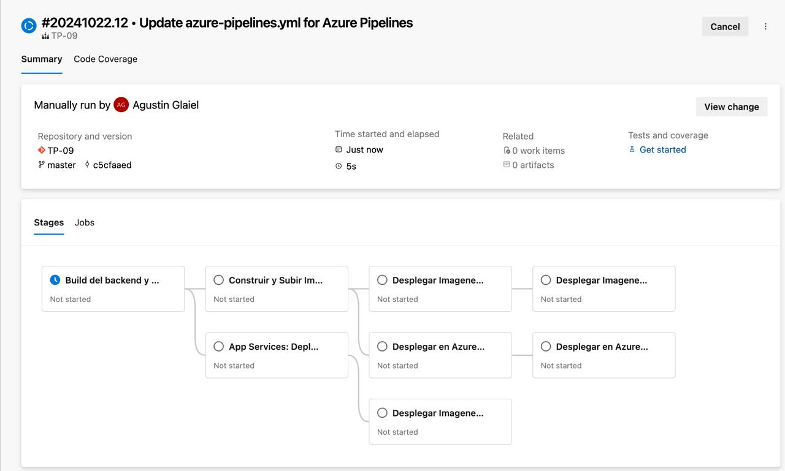
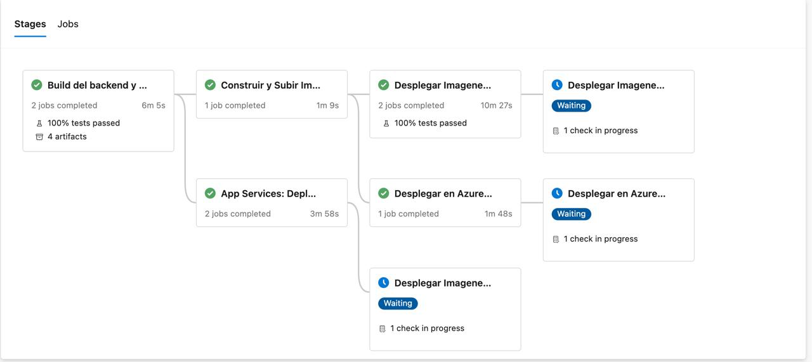
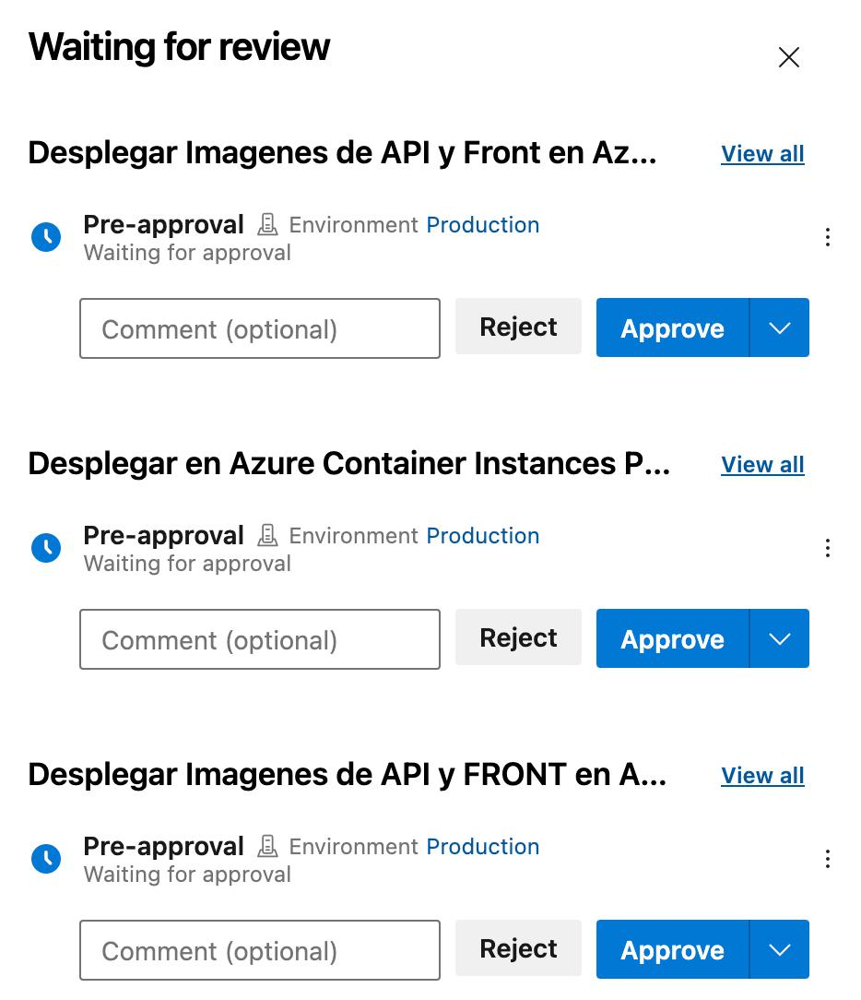
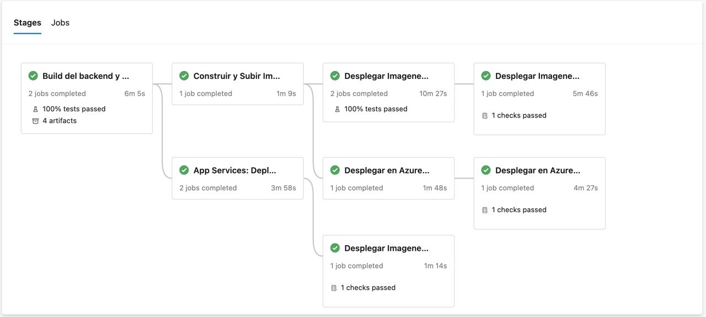
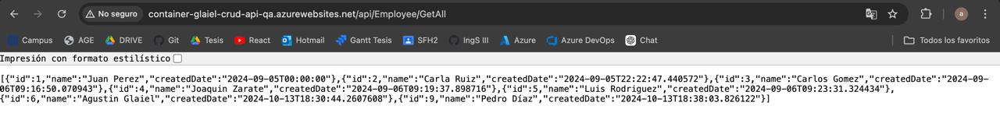
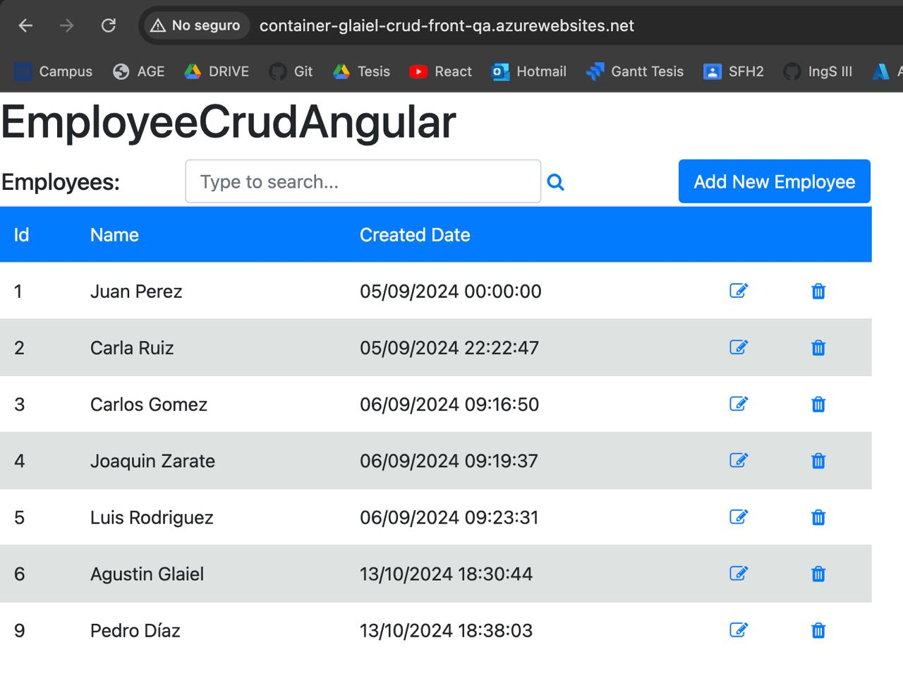
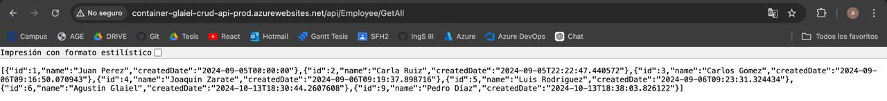

# Trabajo Práctico Número 9

## Punto 1: Agregar tareas para generar Front en Azure App Service con Soporte para Contenedores


## Punto 2: Agregar variables necesarias para el funcionamiento de la nueva etapa considerando que debe haber 2 entornos QA y PROD para Back y Front


## Punto 3: Agregar tareas para correr pruebas de integración en el entorno de QA de Back y Front creado en Azure App Services con Soporte para Contenedores.


## Punto 4: Agregar etapa que dependa de la etapa de Deploy en QA que genere un entorno de PROD.


## Punto 5: Entregar un pipeline que incluya: (Puntos A a I)

De momento realicé todos los puntos menos los relacionados a Azuer Web Apps (Punto C e I)









El pipeline utilizado para lo hecho hasta ahora es:

```
trigger:
- main

pool:
  vmImage: 'windows-latest'

variables:
  solution: '**/*.sln'
  buildPlatform: 'Any CPU'
  buildConfiguration: 'Release'
  frontPath: 'EmployeeCrudAngular'
  ConnectedServiceName: 'ServiceConnectionARM'
  acrLoginServer: 'agingsoft3uccacr.azurecr.io'
  acrName: 'AGIngSoft3UCCACR'
  backImageName: 'employee-crud-api'
  frontImageName: 'employee-crud-frontend'
  ResourceGroupName: 'TPSIngSoft3UCC2024'
  backContainerInstanceNameQA: 'as-crud-api-qa-agustinglaiel'
  frontContainerInstanceNameQA: 'as-crud-front-qa-agustinglaiel'
  frontImageTag: 'latest'
  container-cpu-front-qa: 1
  container-memory-front-qa: 1.5
  backImageTag: 'latest'
  container-cpu-api-qa: 1
  container-memory-api-qa: 1.5
  baseUrlBackEnd: 'http://$(backContainerInstanceNameQA).eastus.azurecontainer.io'
  baseUrlFrontEnd: 'http://$(frontContainerInstanceNameQA).eastus.azurecontainer.io'
  backContainerInstanceNamePROD: 'as-crud-api-prod-agustinglaiel'
  frontContainerInstanceNamePROD: 'as-crud-front-prod-agustinglaiel'
  container-cpu-api-prod: 1
  container-memory-api-prod: 1.5
  container-cpu-front-prod: 1
  container-memory-front-prod: 1.5
  WebAppApiNameContainersQA: 'container-glaiel-crud-api-qa'
  WebAppFrontNameContainersQA: 'container-glaiel-crud-front-qa'
  AppServicePlanLinux: MiAppPlanGlaiel
  AppServicePlanWindows: MiAppPlan01
  WebAppApiNameContainersPROD: 'container-glaiel-crud-api-prod'
  WebAppFrontNameContainerPROD: 'container-glaiel-crud-front-prod'

stages:
  - stage: BuildAndTest
    displayName: "Build del backend y frontend"
    jobs:
      - job: BuildBackend
        displayName: "Build del backend"
        steps:

          - task: DotNetCoreCLI@2
            displayName: "Restaurar paquetes NuGet"
            inputs:
              command: restore
              projects: '**/*.csproj'

          - task: DotNetCoreCLI@2
            displayName: 'Ejecutar pruebas de la API'
            inputs:
              command: 'test'
              projects: '**/*.Tests.csproj'
              arguments: '--collect:"XPlat Code Coverage" --logger "trx;LogFileName=$(Agent.TempDirectory)/TestResults.trx" --blame'  # Corrección en el logger y eliminación del duplicado
              publishTestResults: true

          - task: PublishCodeCoverageResults@2
            displayName: "Publish Back-End Code Coverage Results"
            inputs:
              codeCoverageTool: "cobertura"
              summaryFileLocation: "$(Agent.TempDirectory)/**/coverage.cobertura.xml"
              failIfCoverageEmpty: false

          - task: DotNetCoreCLI@2
            displayName: 'Compilar la API'
            inputs:
              command: build
              projects: '$(solution)'
              arguments: '--configuration $(buildConfiguration)'
              zipAfterPublish: false

          - task: DotNetCoreCLI@2
            displayName: 'Publicar aplicación'
            inputs:
              command: publish
              publishWebProjects: True
              arguments: '--configuration $(buildConfiguration) --output $(Build.ArtifactStagingDirectory)'
              zipAfterPublish: false

          - task: PublishBuildArtifacts@1
            displayName: 'Publicar artefactos de compilación'
            inputs:
              PathtoPublish: '$(Build.ArtifactStagingDirectory)'
              ArtifactName: 'api-drop'
              publishLocation: 'Container'

          - task: PublishPipelineArtifact@1
            displayName: 'Publicar Dockerfile de Back'
            inputs:
              targetPath: '$(Build.SourcesDirectory)/docker/api/Dockerfile'
              artifact: 'dockerfile-back'

      - job: BuildFrontend
        displayName: "Build del frontend"
        dependsOn: [BuildBackend]
        pool:
          vmImage: 'ubuntu-latest'
        steps:
        - checkout: self
          fetchDepth: 0


        - task: NodeTool@0
          displayName: 'Instalar Node.js'
          inputs:
            versionSpec: '22.x'

        - script: npm install --legacy-peer-deps
          displayName: 'Instalar dependencias'
          workingDirectory: $(System.DefaultWorkingDirectory)/$(frontPath)

        - script: npx ng test --karma-config=$(System.DefaultWorkingDirectory)/$(frontPath)/karma.conf.js --watch=false --browsers ChromeHeadless --code-coverage
          displayName: 'Ejecutar pruebas del front'
          workingDirectory: $(System.DefaultWorkingDirectory)/$(frontPath)

        # Publicar resultados de pruebas del front
        - task: PublishTestResults@2
          displayName: 'Publicar resultados de pruebas unitarias del front'
          inputs:
            testResultsFormat: 'JUnit'
            testResultsFiles: '$(System.DefaultWorkingDirectory)/$(frontPath)/test-results/test-results.xml'
            failTaskOnFailedTests: true

        # Publicar resultados de cobertura del front
        - task: PublishCodeCoverageResults@2
          displayName: 'Publicar resultados de code coverage del front'
          inputs:
            summaryFileLocation: '$(System.DefaultWorkingDirectory)/$(frontPath)/coverage/lcov.info'
            failIfCoverageEmpty: false

        - script: npm run build
          displayName: 'Compilar el proyecto Angular'
          workingDirectory: $(System.DefaultWorkingDirectory)/$(frontPath)

        - task: PublishBuildArtifacts@1
          displayName: 'Publicar artefactos Angular'
          inputs:
            PathtoPublish: '$(System.DefaultWorkingDirectory)/$(frontPath)/dist'
            ArtifactName: 'front-drop'

        # Verificar si el Dockerfile del front existe antes de publicarlo
        - script: |
            if [ -f "$(Build.SourcesDirectory)/docker/front/Dockerfile" ]; then
              echo "Dockerfile de Front encontrado."
            else
              echo "Dockerfile de Front no encontrado."
              exit 1
            fi
          displayName: 'Verificar existencia de Dockerfile de Front'

        # Publicar Dockerfile de Front
        - task: PublishPipelineArtifact@1
          displayName: 'Publicar Dockerfile de Front'
          inputs:
            targetPath: '$(Build.SourcesDirectory)/docker/front/Dockerfile'
            artifact: 'dockerfile-front'

  - stage: DockerBuildAndPush
    displayName: 'Construir y Subir Imágenes Docker a ACR'
    dependsOn: BuildAndTest
    jobs:
    - job: docker_build_and_push
      displayName: 'Construir y Subir Imágenes Docker a ACR'
      pool:
        vmImage: 'ubuntu-latest'

      steps:
        - checkout: self

        #----------------------------------------------------------
        # BUILD DOCKER BACK IMAGE Y PUSH A AZURE CONTAINER REGISTRY
        #----------------------------------------------------------

        - task: DownloadPipelineArtifact@2
          displayName: 'Descargar Artefactos de Back'
          inputs:
            buildType: 'current'
            artifactName: 'api-drop'
            targetPath: '$(Pipeline.Workspace)/drop-back'

        - task: DownloadPipelineArtifact@2
          displayName: 'Descargar Dockerfile de Back'
          inputs:
            buildType: 'current'
            artifactName: 'dockerfile-back'
            targetPath: '$(Pipeline.Workspace)/dockerfile-back'

        - task: AzureCLI@2
          displayName: 'Iniciar Sesión en Azure Container Registry (ACR)'
          inputs:
            azureSubscription: '$(ConnectedServiceName)'
            scriptType: bash
            scriptLocation: inlineScript
            inlineScript: |
              az acr login --name $(acrLoginServer)

        - task: Docker@2
          displayName: 'Construir Imagen Docker para Back'
          inputs:
            command: build
            repository: $(acrLoginServer)/$(backImageName)
            dockerfile: $(Pipeline.Workspace)/dockerfile-back/Dockerfile
            buildContext: $(Pipeline.Workspace)/drop-back
            tags: 'latest'

        - task: Docker@2
          displayName: 'Subir Imagen Docker de Back a ACR'
          inputs:
            command: push
            repository: $(acrLoginServer)/$(backImageName)
            tags: 'latest'

        #----------------------------------------------------------
        # BUILD DOCKER FRONT IMAGE Y PUSH A AZURE CONTAINER REGISTRY
        #----------------------------------------------------------

        - task: DownloadPipelineArtifact@2
          displayName: 'Descargar Artefactos de Front'
          inputs:
            buildType: 'current'
            artifactName: 'front-drop'
            targetPath: '$(Pipeline.Workspace)/drop-front'

        - task: DownloadPipelineArtifact@2
          displayName: 'Descargar Dockerfile de Front'
          inputs:
            buildType: 'current'
            artifactName: 'dockerfile-front'
            targetPath: '$(Pipeline.Workspace)/dockerfile-front'

        - task: AzureCLI@2
          displayName: 'Iniciar Sesión en Azure Container Registry (ACR)'
          inputs:
            azureSubscription: '$(ConnectedServiceName)'
            scriptType: bash
            scriptLocation: inlineScript
            inlineScript: |
              az acr login --name $(acrLoginServer)

        - task: Docker@2
          displayName: 'Construir Imagen Docker para Front'
          inputs:
            command: build
            repository: $(acrLoginServer)/$(frontImageName)
            dockerfile: $(Pipeline.Workspace)/dockerfile-front/Dockerfile
            buildContext: $(Pipeline.Workspace)/drop-front/employee-crud-angular/browser
            tags: 'latest'

        - task: Docker@2
          displayName: 'Subir Imagen Docker de Front a ACR'
          inputs:
            command: push
            repository: $(acrLoginServer)/$(frontImageName)
            tags: 'latest'

#---------------------------------------
### STAGE DEPLOY TO AZURE APP SERVICE QA
#---------------------------------------
  - stage: DeployImagesToAppServiceQA
    displayName: 'Desplegar Imagenes en Azure App Service (QA)'
    dependsOn: DockerBuildAndPush
    condition: succeeded()
    jobs:
      - job: DeployImagesToAppServiceQA
        displayName: 'Desplegar Imagenes de API y Front en Azure App Service (QA)'
        pool:
          vmImage: 'ubuntu-latest'
        steps:
          #------------------------------------------------------
          # DEPLOY DOCKER API IMAGE TO AZURE APP SERVICE (QA)
          #------------------------------------------------------
          - task: AzureCLI@2
            displayName: 'Verificar y crear el recurso Azure App Service para API (QA) si no existe'
            inputs:
              azureSubscription: '$(ConnectedServiceName)'
              scriptType: 'bash'
              scriptLocation: 'inlineScript'
              inlineScript: |
                # Verificar si el App Service para la API ya existe
                if ! az webapp list --query "[?name=='$(WebAppApiNameContainersQA)' && resourceGroup=='$(ResourceGroupName)'] | length(@)" -o tsv | grep -q '^1$'; then
                  echo "El App Service para API QA no existe. Creando..."
                  # Crear el App Service sin especificar la imagen del contenedor
                  az webapp create --resource-group $(ResourceGroupName) --plan $(AppServicePlanLinux) --name $(WebAppApiNameContainersQA) --deployment-container-image-name "nginx"  # Especifica una imagen temporal para permitir la creación
                else
                  echo "El App Service para API QA ya existe. Actualizando la imagen..."
                fi

                # Configurar el App Service para usar Azure Container Registry (ACR)
                az webapp config container set --name $(WebAppApiNameContainersQA) --resource-group $(ResourceGroupName) \
                  --container-image-name $(acrLoginServer)/$(backImageName):$(backImageTag) \
                  --container-registry-url https://$(acrLoginServer) \
                  --container-registry-user $(acrName) \
                  --container-registry-password $(az acr credential show --name $(acrName) --query "passwords[0].value" -o tsv)
                # Establecer variables de entorno
                az webapp config appsettings set --name $(WebAppApiNameContainersQA) --resource-group $(ResourceGroupName) \
                  --settings ConnectionStrings__DefaultConnection="$(cnn-string-qa)" \

          - task: AzureCLI@2
            displayName: 'Verificar y crear el recurso Azure App Service para FRONT (QA) si no existe'
            inputs:
              azureSubscription: '$(ConnectedServiceName)'
              scriptType: 'bash'
              scriptLocation: 'inlineScript'
              inlineScript: |
                if ! az webapp list --query "[?name=='$(WebAppFrontNameContainersQA)' && resourceGroup=='$(ResourceGroupName)'] | length(@)" -o tsv | grep -q '^1$'; then
                  echo "El app service para FRONT QA no existe. Creando..."
                  # Crear el App Service sin especificar la imagen del contenedor
                  az webapp create --resource-group $(ResourceGroupName) --plan $(AppServicePlanLinux) --name $(WebAppFrontNameContainersQA) --deployment-container-image-name "nginx"  # Especifica una imagen temporal para permitir la creación
                else
                  echo "El App Service para API QA ya existe. Actualizando la imagen..."
                fi

                # Configurar el App Service para usar Azure Container Registry (ACR)
                az webapp config container set --name $(WebAppFrontNameContainersQA) --resource-group $(ResourceGroupName) \
                  --container-image-name $(acrLoginServer)/$(frontImageName):$(frontImageTag) \
                  --container-registry-url https://$(acrLoginServer) \
                  --container-registry-user $(acrName) \
                  --container-registry-password $(az acr credential show --name $(acrName) --query "passwords[0].value" -o tsv)
                # Establecer variables de entorno
                az webapp config appsettings set --name $(WebAppFrontNameContainersQA) --resource-group $(ResourceGroupName) \
                  --settings API_URL="$(API_URL_QA)" \


      - job: IngtegrationTests
        displayName: 'Tests de Integracion'
        dependsOn: DeployImagesToAppServiceQA
        variables:
          baseUrl: '$(WebAppFrontNameContainersQA).azurewebsites.net'

        steps:
          - script: |
              cd $(Build.SourcesDirectory)/EmployeeCrudAngular
              npm install typescript ts-node --legacy-peer-deps
            displayName: 'Install Typescript'

          # Ejecutar Pruebas Cypress
          - script: |
              cd $(Build.SourcesDirectory)/EmployeeCrudAngular
              npx cypress run --config-file cypress.config.ts --env baseUrl=$(baseUrl)
            displayName: 'Run Cypress E2E Tests'

          - task: PublishTestResults@2
            inputs:
              testResultsFiles: '$(Build.SourcesDirectory)/EmployeeCrudAngular/cypress/results/*.xml'
              testRunTitle: 'Cypress E2E Tests (QA)'
            displayName: 'Publicar resultados de Cypress'

#----------------------------------------------------------
### STAGE DEPLOY TO ACI QA
#----------------------------------------------------------
  - stage: DeployToACIQA
    displayName: 'Desplegar en Azure Container Instances (ACI) QA'
    dependsOn: DockerBuildAndPush
    jobs:
      - job: deploy_to_aci_qa
        displayName: 'Desplegar en Azure Container Instances (ACI) QA'
        pool:
          vmImage: 'ubuntu-latest'

        steps:
        #------------------------------------------------------
        # DEPLOY DOCKER BACK IMAGE A AZURE CONTAINER INSTANCES QA
        #------------------------------------------------------
        - task: AzureCLI@2
          displayName: 'Desplegar Imagen Docker de Back en ACI QA'
          inputs:
            azureSubscription: '$(ConnectedServiceName)'
            scriptType: bash
            scriptLocation: inlineScript
            inlineScript: |
              echo "Resource Group: $(ResourceGroupName)"
              echo "Container Instance Name: $(backContainerInstanceNameQA)"
              echo "ACR Login Server: $(acrLoginServer)"
              echo "Image Name: $(backImageName)"
              echo "Image Tag: $(backImageTag)"
              echo "Connection String: $(cnn-string-qa)"

              az container delete --resource-group $(ResourceGroupName) --name $(backContainerInstanceNameQA) --yes

              az container create --resource-group $(ResourceGroupName) \
              --name $(backContainerInstanceNameQA) \
              --image $(acrLoginServer)/$(backImageName):$(backImageTag) \
              --registry-login-server $(acrLoginServer) \
              --registry-username $(acrName) \
              --registry-password $(az acr credential show --name $(acrName) --query "passwords[0].value" -o tsv) \
              --dns-name-label $(backContainerInstanceNameQA) \
              --ports 80 \
              --environment-variables ConnectionStrings__DefaultConnection="$(cnn-string-qa)" \
              --restart-policy Always \
              --cpu $(container-cpu-api-qa) \
              --memory $(container-memory-api-qa)

        - task: AzureCLI@2
          displayName: 'Desplegar Imagen Docker de Front en ACI QA'
          inputs:
            azureSubscription: '$(ConnectedServiceName)'
            scriptType: bash
            scriptLocation: inlineScript
            inlineScript: |
              echo "Resource Group: $(ResourceGroupName)"
              echo "Container Instance Name: $(frontContainerInstanceNameQA)"
              echo "ACR Login Server: $(acrLoginServer)"
              echo "Image Name: $(frontImageName)"
              echo "Image Tag: $(frontImageTag)"
              echo "API URL: $(API_URL)"

              az container delete --resource-group $(ResourceGroupName) --name $(frontContainerInstanceNameQA) --yes

              az container create --resource-group $(ResourceGroupName) \
              --name $(frontContainerInstanceNameQA) \
              --image $(acrLoginServer)/$(frontImageName):$(frontImageTag) \
              --registry-login-server $(acrLoginServer) \
              --registry-username $(acrName) \
              --registry-password $(az acr credential show --name $(acrName) --query "passwords[0].value" -o tsv) \
              --dns-name-label $(frontContainerInstanceNameQA) \
              --ports 80 \
              --environment-variables API_URL=$(API_URL) \
              --restart-policy Always \
              --cpu $(container-cpu-front-qa) \
              --memory $(container-memory-front-qa)

      - job: IntegrationTests
        displayName: 'Run Cypress Integration Tests'
        dependsOn: deploy_to_aci_qa
        variables:
          baseUrl: '$(frontContainerInstanceNameQA).eastus.azurecontainer.io'
        steps:
          - script: |
              cd $(Build.SourcesDirectory)/EmployeeCrudAngular
              npm install typescript ts-node --legacy-peer-deps
            displayName: 'Install Typescript'

          - script: |
              cd $(Build.SourcesDirectory)/EmployeeCrudAngular
              npx cypress run --config-file cypress.config.ts --env baseUrl=$(baseUrl)
            displayName: 'Run Cypress E2E Tests'

          # Publicamos resultados
          - task: PublishTestResults@2
            inputs:
              testResultsFiles: '$(Build.SourcesDirectory)/EmployeeCrudAngular/cypress/results/*.xml'
              testRunTitle: 'Cypress E2E Tests (QA)'
            displayName: 'Publicar resultados de Cypress'

#---------------------------------------
### STAGE DEPLOY TO AZURE APP SERVICE PROD
#---------------------------------------
  - stage: DeployImagesToAppServicePROD
    displayName: 'Desplegar Imagenes de API y FRONT en Azure App Service (PROD)'
    dependsOn: DeployImagesToAppServiceQA
    condition: succeeded()
    jobs:
      - deployment: DeployToProd
        displayName: 'Desplegar Imagenes de API y FRONT en Azure App Service (PROD)'
        environment: 'Production'
        strategy:
          runOnce:
            deploy:
              steps:
                #------------------------------------------------------
                # DEPLOY DOCKER API IMAGE TO AZURE APP SERVICE (QA)
                #------------------------------------------------------

              - task: AzureCLI@2
                displayName: 'Verificar y crear el recurso Azure App Service para API (PROD) si no existe'
                inputs:
                  azureSubscription: '$(ConnectedServiceName)'
                  scriptType: 'bash'
                  scriptLocation: 'inlineScript'
                  inlineScript: |
                    # Verificar si el App Service para la API ya existe
                    if ! az webapp list --query "[?name=='$(WebAppApiNameContainersPROD)' && resourceGroup=='$(ResourceGroupName)'] | length(@)" -o tsv | grep -q '^1$'; then
                      echo "El App Service para API QA no existe. Creando..."
                      # Crear el App Service sin especificar la imagen del contenedor
                      az webapp create --resource-group $(ResourceGroupName) --plan $(AppServicePlanLinux) --name $(WebAppApiNameContainersPROD) --deployment-container-image-name "nginx"  # Especifica una imagen temporal para permitir la creación
                    else
                      echo "El App Service para API QA ya existe. Actualizando la imagen..."
                    fi

                    # Configurar el App Service para usar Azure Container Registry (ACR)
                    az webapp config container set --name $(WebAppApiNameContainersPROD) --resource-group $(ResourceGroupName) \
                      --container-image-name $(acrLoginServer)/$(backImageName):$(backImageTag) \
                      --container-registry-url https://$(acrLoginServer) \
                      --container-registry-user $(acrName) \
                      --container-registry-password $(az acr credential show --name $(acrName) --query "passwords[0].value" -o tsv)
                    # Establecer variables de entorno
                    az webapp config appsettings set --name $(WebAppApiNameContainersPROD) --resource-group $(ResourceGroupName) \
                      --settings ConnectionStrings__DefaultConnection="$(cnn-string-prod)" \

              - task: AzureCLI@2
                displayName: 'Verificar y crear el recurso Azure App Service para FRONT (QA) si no existe'
                inputs:
                  azureSubscription: '$(ConnectedServiceName)'
                  scriptType: 'bash'
                  scriptLocation: 'inlineScript'
                  inlineScript: |
                    if ! az webapp list --query "[?name=='$(WebAppFrontNameContainerPROD)' && resourceGroup=='$(ResourceGroupName)'] | length(@)" -o tsv | grep -q '^1$'; then
                      echo "El app service para FRONT QA no existe. Creando..."
                      # Crear el App Service sin especificar la imagen del contenedor
                      az webapp create --resource-group $(ResourceGroupName) --plan $(AppServicePlanLinux) --name $(WebAppFrontNameContainerPROD) --deployment-container-image-name "nginx"  # Especifica una imagen temporal para permitir la creación
                    else
                      echo "El App Service para API QA ya existe. Actualizando la imagen..."
                    fi

                    # Configurar el App Service para usar Azure Container Registry (ACR)
                    az webapp config container set --name $(WebAppFrontNameContainerPROD) --resource-group $(ResourceGroupName) \
                      --container-image-name $(acrLoginServer)/$(frontImageName):$(frontImageTag) \
                      --container-registry-url https://$(acrLoginServer) \
                      --container-registry-user $(acrName) \
                      --container-registry-password $(az acr credential show --name $(acrName) --query "passwords[0].value" -o tsv)
                    # Establecer variables de entorno
                    az webapp config appsettings set --name $(WebAppFrontNameContainerPROD) --resource-group $(ResourceGroupName) \
                      --settings API_URL="$(API_URL_PROD)" \

# #----------------------------------------------------------
# ### STAGE DEPLOY TO ACI PROD
# #----------------------------------------------------------
  - stage: DeployToACIPROD
    displayName: 'Desplegar en Azure Container Instances PROD'
    dependsOn: DeployToACIQA
    jobs:
      - deployment: DeployToProd
        displayName: 'Desplegar en Azure Container Instances PROD'
        environment: 'Production'
        strategy:
          runOnce:
            deploy:
              steps:
              #----------------------------------------------------------
              # DEPLOY DOCKER BACK IMAGE A AZURE CONTAINER INSTANCES PROD
              #----------------------------------------------------------
              - task: AzureCLI@2
                displayName: 'Desplegar Imagen Docker de Back en ACI PROD'
                inputs:
                  azureSubscription: '$(ConnectedServiceName)'
                  scriptType: bash
                  scriptLocation: inlineScript
                  inlineScript: |
                    echo "Resource Group: $(ResourceGroupName)"
                    echo "Container Instance Name: $(backContainerInstanceNamePROD)"
                    echo "ACR Login Server: $(acrLoginServer)"
                    echo "Image Name: $(backImageName)"
                    echo "Image Tag: $(backImageTag)"
                    echo "API URL: $(cnn-string-prod)"

                    az container delete --resource-group $(ResourceGroupName) --name $(backContainerInstanceNamePROD) --yes

                    az container create --resource-group $(ResourceGroupName) \
                    --name $(backContainerInstanceNamePROD) \
                    --image $(acrLoginServer)/$(backImageName):$(backImageTag) \
                    --registry-login-server $(acrLoginServer) \
                    --registry-username $(acrName) \
                    --registry-password $(az acr credential show --name $(acrName) --query "passwords[0].value" -o tsv) \
                    --dns-name-label $(backContainerInstanceNamePROD) \
                    --ports 80 \
                    --environment-variables ConnectionStrings__DefaultConnection="$(cnn-string-prod)" \
                    --restart-policy Always \
                    --cpu $(container-cpu-api-qa) \
                    --memory $(container-memory-api-qa)

              - task: AzureCLI@2
                displayName: 'Desplegar Imagen Docker de Front en ACI PROD'
                inputs:
                  azureSubscription: '$(ConnectedServiceName)'
                  scriptType: bash
                  scriptLocation: inlineScript
                  inlineScript: |
                    echo "Resource Group: $(ResourceGroupName)"
                    echo "Container Instance Name: $(frontContainerInstanceNamePROD)"
                    echo "ACR Login Server: $(acrLoginServer)"
                    echo "Image Name: $(frontImageName)"
                    echo "Image Tag: $(frontImageTag)"
                    echo "API URL: $(API_URL_PROD)"

                    az container delete --resource-group $(ResourceGroupName) --name $(frontContainerInstanceNamePROD) --yes

                    az container create --resource-group $(ResourceGroupName) \
                    --name $(frontContainerInstanceNamePROD) \
                    --image $(acrLoginServer)/$(frontImageName):$(frontImageTag) \
                    --registry-login-server $(acrLoginServer) \
                    --registry-username $(acrName) \
                    --registry-password $(az acr credential show --name $(acrName) --query "passwords[0].value" -o tsv) \
                    --dns-name-label $(frontContainerInstanceNamePROD) \
                    --ports 80 \
                    --environment-variables API_URL=$(API_URL_PROD) \
                    --restart-policy Always \
                    --cpu $(container-cpu-front-prod) \
                    --memory $(container-memory-front-prod)

```
